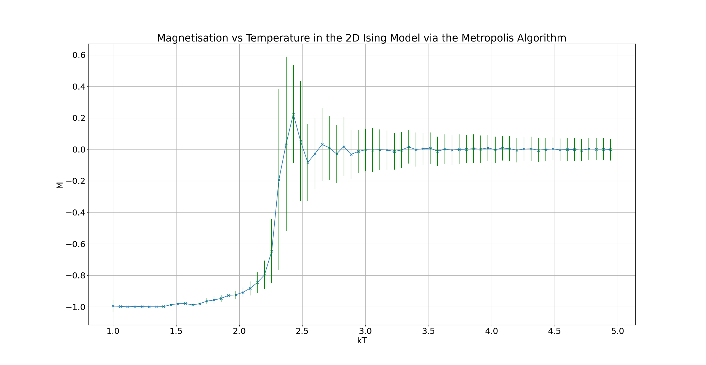

# IsingMetVsWolff
Implementation of the 2D Ising model via the Metropolis and Wolff algorithms in C++

#### Features:
- 

---

---

#### TODO:
- Update the saving to disk functionality
- Implement Wolff algorithm
- List features
